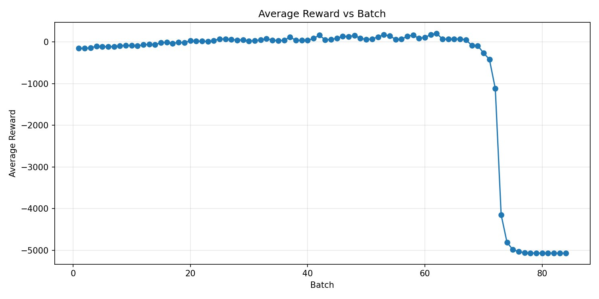
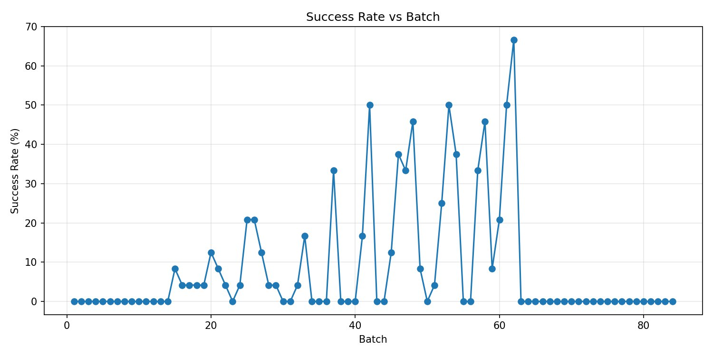
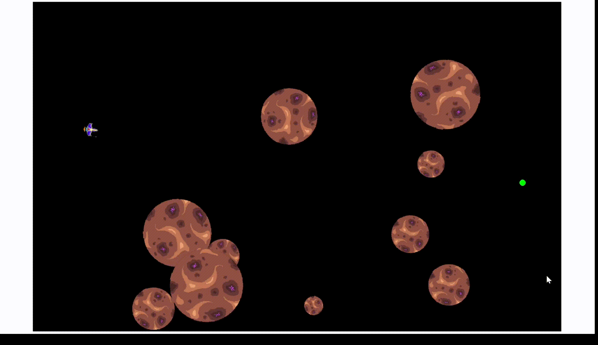

# Space Odyssey — Reinforcement Learning for 2D Space Navigation (REINFORCE + TRPO)

## Problem description

The agent controls a 2D spacecraft and must **reach a target goal location** while **avoiding collisions with asteroids** within a limited number of steps.

At each discrete time step $t$, the agent selects an action $a_t$ consisting of **forward thrust** and **rotation**. The environment then updates the spacecraft state, returns the next observation $o_{t+1}$, a scalar reward $r_t$, and episode termination flags.

The learning objective is to maximize the expected discounted cumulative reward:

$$
J(\theta)=\mathbb{E}_{\pi_\theta}\left[\sum_{t=0}^{T-1}\gamma^t r_t\right]
$$

where:
- $\pi_\theta(a|s)$ is the policy parameterized by $\theta$,
- $r_t$ is the reward obtained at step $t$,
- $T$ is the episode length (bounded by termination conditions such as goal/collision/timeout),
- $\gamma \in (0,1)$ is the discount factor defined in the training configuration.

---

## Environment dynamics (MDP)

Environment implementation: `src/env/environment.py`.

### Observation space

The environment returns an **observation vector** $o_t \in \mathbb{R}^d$.

The observation dimension is

$d = 2 + 2 + 1 + 1 + 2 + 3N = 8 + 3N$, N = `num_asteroids`


The components correspond to:

- **2** — relative position of the goal in the ship body frame $(x,y)$  
- **2** — ship velocity in the body frame $(v_x, v_y)$  
- **1 + 1** — $\sin(\Delta\psi)$ and $\cos(\Delta\psi)$ 
- **2** — normalized scalar features (goal distance and angular velocity)  
- **$3N$** — per-asteroid features for the $N$ nearest asteroids:
  - body-frame angle (normalized by $\pi$)
  - normalized surface distance
  - normalized radius

### Action space

The action is $$a_t=(a_t^{\text{thrust}}, a_t^{\text{rot}})\in[-1,1]^2.$$

#### Forward thrust remapping

Let $\sigma(x)=\frac{1}{1+e^{-x}}$, k=`throttle_gain`, c=`throttle_center`, and $a=\mathrm{clip}(a_t^{\text{thrust}},-1,1)$. 
Then:

<!-- $$
u_t=\text{clip}\left(
\frac{\sigma(k(a-c))-\sigma(k(-1-c))}
{\sigma(k(1-c))-\sigma(k(-1-c))+10^{-8}},
\,0,\,1\right).
$$ -->

$u_t = \text{clip}\left( \frac{\sigma(k(a-c)) - \sigma(k(-1-c))}{\sigma(k(1-c)) - \sigma(k(-1-c)) + 10^{-8}},\ 0,\ 1 \right)$

The rotation channel is clipped:

$$
\tau_t=\mathrm{clip}(a_t^{\text{rot}},-1,1).
$$

### Transition logic

The environment uses a fixed integration time step

$$
dt = 0.1.
$$

The spacecraft state consists of:

- position $p_t \in \mathbb{R}^2$,
- velocity $v_t \in \mathbb{R}^2$,
- heading angle $\theta_t \in \mathbb{R}$,
- angular velocity $\omega_t \in \mathbb{R}$.

The forward direction of the spacecraft is

$$
d(\theta_t)=(\cos\theta_t,\ \sin\theta_t).
$$

At each step the control inputs are thrust $u_t$ and rotational control $\tau_t$.

The dynamics implemented by `Ship.apply_thrust()` and `Ship.update()` correspond to a semi-implicit Euler integration:

$$
v_{t+1}=v_t + u_t\,d(\theta_t)\,dt
$$

$$
\omega_{t+1}=\omega_t + \tau_t\,dt
$$

$$
\theta_{t+1}=\theta_t + \omega_{t+1}\,dt
$$

$$
p_{t+1}=p_t + v_{t+1}\,dt
$$

### Deterministic vs stochastic transitions

The transition function is **deterministic**:

$$
s_{t+1}=f(s_t,a_t)
$$

because the environment step contains no random sampling.

Randomness only appears in the environment **initialization**, where the ship, goal, and asteroids are spawned at random locations during `reset()`.

---

## Episode termination conditions

Termination logic is implemented in `SpaceEnv.step`.

1) **Goal reached**

$$
||p_t-g||_2 < r_{\text{ship}} + 5
$$

The episode terminates with `termination_reason="goal"`.

2) **Collision with an asteroid**

$$
||p_t-p^{ast}||_2 < r_{\text{ship}} + r_{\text{ast}}
$$

The episode terminates with `termination_reason="asteroid"`.

3) **Timeout**

$t \ge$ `max_steps`

## Reward function

Reward is computed by `reward_function(env)` in `src/env/reward.py` and returned each step by `SpaceEnv.step`.

Let:
- $d_t = ||p_t - g||_2$ (distance to goal)
- $\Delta d = d_{t-1} - d_t$ (progress)
- $D = \sqrt{W^2 + H^2}$ with $(W, H)$ = `space_size`
- `dist_norm`= $\frac{d_t}{D + \varepsilon}$

### Terminal events

The environment terminates on goal, collision, or timeout, and the code assigns terminal rewards accordingly.

| Event | Condition | Reward |
|---|---|---:|
| Goal reached | $\lVert p_t - g\rVert_2 < r_{\text{ship}} + 5$ | $+500$ |
| Collision | $\lVert p_t - p^{\text{ast}}\rVert_2 < r_{\text{ship}} + r_{\text{ast}}$ | $-200$ |
| Timeout | episode ends by timeout (truncated) | $-0.01\,\lVert p_t - g\rVert_2$ |


<!-- ## Reward shaping

For non-terminal steps the reward is

$$
r_t =
r_{\text{progress}}
+ r_{\text{velocity}}
+ r_{\text{alignment}}
+ r_{\text{angular}}
+ r_{\text{obstacles}}.
$$

### Progress

$$
r_{\text{progress}} = 0.3 \,\Delta d \, b(d_t),
\qquad
b(d_t)=1+\frac{\alpha}{1+(\text{dist\_norm}/d_0)^2},
$$

with $\alpha=1.2$, $d_0=0.12$.

### Velocity toward goal

Let $\hat g=\frac{g-p_t}{\|g-p_t\|}$ and $v_{\text{goal}}=v_t\cdot\hat g$.

$$
r_{\text{velocity}} = 0.18\,\tanh\!\left(\frac{v_{\text{goal}}}{4}\right).
$$

### Alignment

Let $\theta_{\text{err}}$ be the heading error to the goal.

$$
r_{\text{alignment}} =
0.16\cos(\theta_{\text{err}})
-0.08|\sin(\theta_{\text{err}})|.
$$

### Angular velocity

$$
r_{\text{angular}} = -0.06|\omega| - 0.006\,\omega^2.
$$

### Obstacle avoidance

For the **three closest asteroids** define surface distance

$$
d_{\text{surface}}=\|p_t-p^{\text{ast}}\|_2-(r_{\text{ship}}+r_{\text{ast}}).
$$

If $d_{\text{surface}}<d_{\text{safe}}$ with $d_{\text{safe}}=140$,

$$
danger=1-\text{clip}\!\left(\frac{d_{\text{surface}}}{d_{\text{safe}}},0,1\right),
\qquad
r_{\text{prox}}=-0.8\,danger^2.
$$

If the ship moves toward the asteroid ($v_{\text{ast}}=v_t\cdot\hat a>0$),

$$
r_{\text{approach}}=-0.12\,\frac{v_{\text{ast}}}{8}\,danger^2.
$$ -->

### REINFORCE (Policy Gradient + Baseline)

In this project the policy is a *squashed Gaussian*:
$z_t \sim \mathcal{N}(\mu_\theta(o_t), \sigma_\theta(o_t))$, $a_t=\tanh(z_t)$.

Monte-Carlo returns are computed as

$$
G_t=\sum_{k=t}^{T-1}\gamma^{k-t} r_k.
$$

A value baseline $V_\phi(o_t)$ is used to compute the advantage

$$
\hat A_t = G_t - V_\phi(o_t).
$$

Because actions are squashed with $\tanh$, the log-probability includes the change-of-variables correction:

$$
\log \pi_\theta(a_t|o_t) = \log \mathcal{N}(z_t;\mu_\theta(o_t),\sigma_\theta(o_t)) - \sum_i \log(1-a_{t,i}^2+\epsilon)
$$

где $z_t = \text{atanh}(a_t)$.

The policy is optimized using

$$
\mathcal{L}_\pi = - \mathbb{E}[\log \pi_\theta(a_t|o_t)\,\hat A_t] - \beta\,\mathbb{E}[H(\mathcal N(\mu_\theta,\sigma_\theta))],
$$

where $\beta$ is the entropy coefficient used to encourage exploration.

In code, expectations $\mathbb{E}[\cdot]$ are approximated by empirical means over collected samples (hence `.mean()`).

### TRPO (Trust Region Policy Optimization)

TRPO maximizes the surrogate objective

$$
L(\theta)=\mathbb{E}\left[r_t(\theta)\,\hat A_t\right],
\qquad
r_t(\theta)=\exp\!\left(\log\pi_\theta(a_t|o_t)-\log\pi_{\theta_{\text{old}}}(a_t|o_t)\right).
$$

In this implementation, $\log\pi_\theta(a_t|o_t)$ is the **tanh-squashed** log-probability (computed via $z_t=\text{atanh}(a_t)$  and a $\tanh$ Jacobian correction, same as in REINFORCE).

Advantages are computed using a value baseline and normalization:

$$
\hat A_t = \text{norm}(G_t) - V_\phi(o_t),
\qquad
\hat A_t \leftarrow \text{norm}(\hat A_t),
$$

where $\text{norm}(\cdot)$ denotes z-score normalization over the trajectory batch.

A trust region constraint is enforced using the KL between the **Gaussian pre-tanh** policies:

$$
\mathbb{E}\left[D_{KL}\left(\mathcal{N}_{\theta_{\text{old}}}(\cdot|o_t)\ \|\ \mathcal{N}_{\theta}(\cdot|o_t)\right)\right]\le \delta.
$$

In `TRPOAgent.update`, the step direction is computed via conjugate gradient on a Hessian-vector product of the KL with damping ($H v \leftarrow H v + $ *cg_damping v*), followed by a backtracking line search that accepts a step only if $L(\theta)$ improves and the KL constraint is satisfied.

## Results








---
## Evaluation
  
It runs a trained agent in the environment **without updating the policy** and measures performance over multiple episodes.

After running multiple episodes, the following metrics are computed:

- **Success rate**
  
  $\text{SuccessRate} = \frac{N_{\text{goal}}}{N_{\text{episodes}}}$

- **Collision rate**

  $\text{CollisionRate} = \frac{N_{\text{collision}}}{N_{\text{episodes}}}$

- **Timeout rate**

  $\text{TimeoutRate} = \frac{N_{\text{timeout}}}{N_{\text{episodes}}}$

- **Average episode reward**

  $\bar{R} = \frac{1}{N}\sum_{i=1}^{N} R_i$

where $R_i$ is the cumulative reward obtained in episode $i$.

---

## How to run

Entry point: `main.py`. :contentReference[oaicite:12]{index=12}

### Manual control (sanity check)

```bash
python main.py --manual
```
### Train REINFORCE
```bash
python main.py --train-reinforce
```
### Train TRPO
```bash
python main.py --train-trpo
```
### Watch / evaluation (visualize a trained agent)

Set in configs/runtime.yaml:

watch.agent: reinforce or trpo

watch.model_path: <path_to_checkpoint.pth>

Then run:
```bash
python main.py --watch
```